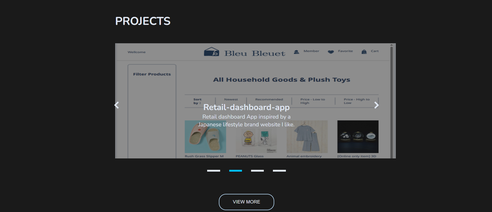
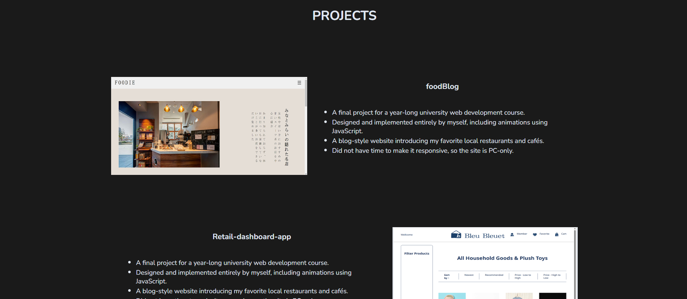

## プロジェクトの背景  
本作品は、フルスタックエンジニアコースで学習した内容を一通り実装し、理解を深めることを目的として制作いたしました。  
そのため、規模はフロントエンド単体でも成立する内容ですが、あえてphpによるバックエンドAPIを含む構成となっております。　　
　　
## 実行にあたっての注意点  
本作品は、phpによるバックエンドAPIを使用しているため、動作確認にはローカルのphp実行環境が必要になります。  
Apache / PHP が動作する環境（XAMPP、ampps など）をご用意ください。  

### ※ 下記のスクリーンショットは、バックエンドAPIが動作している状態で表示される画面です。  
・Homeページ下部のプロジェクトスクロール表示部分  
    
  
・Projectsページ
    
  
本作品はバックエンドの起動が必要な構成のため、実行環境を用意せずとも画面構成や取得データの内容が確認できるよう、スクリーンショットを掲載しています。  
